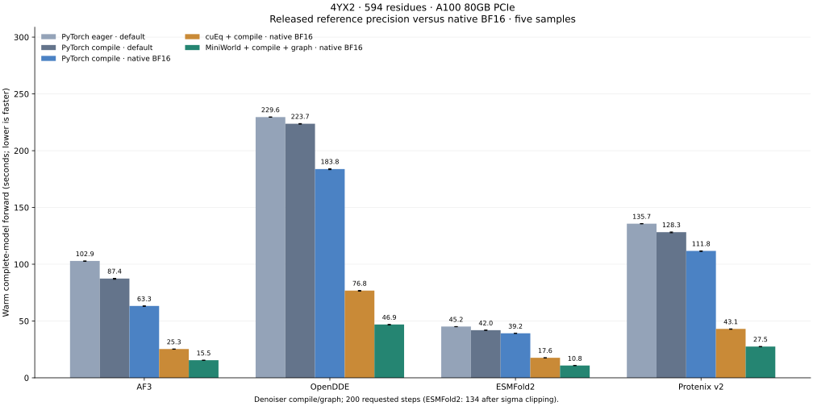
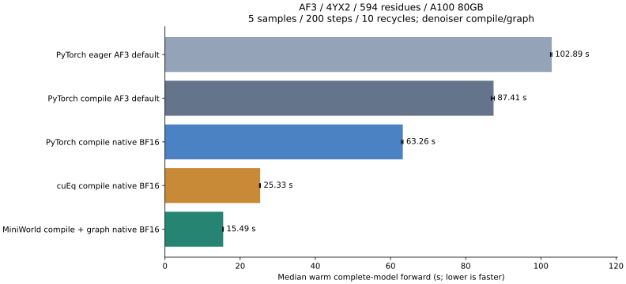

# Inference benchmark results

Updated 2026-09-16. **4YX2: 594 residues, three chains (163 + 218 + 213).**
All four models now have five measured configurations. Reference means each
model's released **precision policy** in FoldForge's PyTorch backend; it is not
the original application's complete runtime. Native BF16 stores learned parameters
in BF16 except FP32 norms and uses no autocast.



Latency is the median of **five warm complete-model forwards**, in seconds.
It includes trunk, diffusion and confidence. It excludes featurization, checkpoint
loading, initial compilation/capture, precomputed ESMC embeddings and CIF output.
The initial forward is reported separately. Error bars are warm min/max.

| Model | Reference eager | Reference compile | Native BF16 compile | cuEq BF16 compile | MiniWorld BF16 compile + graph | MiniWorld vs reference compile |
|---|---:|---:|---:|---:|---:|---:|
| AF3 | 102.889 | 87.412 | 63.264 | 25.329 | 15.487 | 5.64x |
| OpenDDE | 229.598 | 223.745 | 183.808 | 76.809 | 46.943 | 4.77x |
| ESMFold2 | 45.153 | 41.964 | 39.194 | 17.646 | 10.813 | 3.88x |
| Protenix v2 | 135.733 | 128.251 | 111.764 | 43.062 | 27.526 | 4.66x |

**Quality caveat:** Protenix v2 and OpenDDE native BF16 runs show more
local geometry outliers than their default-precision references. The speed
comparison does **not** establish structure-quality equivalence; see the
per-sample checks below.

## Precision and execution conditions

| Model | Reference parameter storage and execution | TF32 in reference |
|---|---|---|
| AF3 | Released mixed parameters: BF16 trunk/confidence Pairformers; FP32 input atom encoder, diffusion, norms and final heads. No autocast. | disabled |
| OpenDDE | FP32 parameters and execution; no autocast. | enabled |
| ESMFold2 | FP32 parameters; BF16 autocast in input/trunk, confidence folding trunk and diffusion pair transitions. Remaining diffusion/head projections FP32. Atom FlashAttention uses BF16 Q/K/V. | enabled |
| Protenix v2 | FP32 parameters; BF16 autocast with diffusion explicitly in FP32. Confidence stays in the outer BF16 autocast scope. | enabled |

Reference AMP scopes follow [Protenix inference](https://github.com/bytedance/Protenix/blob/main/runner/inference.py),
[ESMFold2 pinned implementation](https://github.com/Biohub/transformers/blob/b435f1f92dd5b4a653be57157d4f4f5ddba4f145/src/transformers/models/esmfold2/modeling_esmfold2.py),
and [OpenDDE defaults](https://github.com/aurekaresearch/OpenDDE/blob/main/opendde/config/model_base.py).
These compare backend configurations with common FoldForge adapters, not exact
upstream end-to-end applications. PyTorch mode retains the architecture's permitted
FlashAttention path and uses PyTorch for the other replaceable operations.

All cases use the historical coupled seed=0 policy, MSA depth cap 2048, disabled templates, 200 requested steps
and five samples. Token buckets use multiples of 128: 594 -> 640. OpenDDE expands
internally to 1140 structural tokens -> 1152. Atom buckets are 8192. Inputs and
ESMC cached embeddings are identical across modes within each model.

Compile and manual CUDA graphs apply to the **denoiser**; trunk time remains
included. Inductor automatic graphs are disabled. AF3's 10 additional recycles
give 11 trunk passes; the other adapters use 10 loops/cycles. All four models
batch five diffusion samples. All four MiniWorld token-attention paths
use `num_aug=5` with pair bias shared across samples. ESMFold2 atom SWA
builds RoPE once per structure and expands with `num_aug=5`; its FlashAttention
interface uses flattened `[augmentation * batch, atoms, heads, dim]` rows.
ESMFold2 retains 134 actual steps after its sigma=256 cutoff; other models use 200.

Hardware is A100 80GB PCIe on cssb3/gpu02 and gpu03. Slurm job IDs
are retained in the raw results.
Each mode owns one GPU, requests 16 CPUs and 96 GiB RAM, and uses OMP_NUM_THREADS=8.
PyTorch 2.10.0+cu128. Fresh processes may reuse disk caches. Missing MiniWorld
tuned entries can trigger initial heuristic autotuning; these are warm latencies,
not a claim of fully tuned performance. Per-case logs are preserved under runs/.

## Memory and execution evidence

| Model | Mode | Peak allocated GiB | Warm min-max (s) | Initial forward (s) | Compiled graphs / manual replays | Job |
|---|---|---:|---:|---:|---:|---:|
| AF3 | PyTorch eager · default | 6.62 | 102.543-102.920 | 102.360 | 0 / 0 | 46435 |
| AF3 | PyTorch compile · default | 6.62 | 86.769-87.617 | 167.933 | 1 / 0 | 46436 |
| AF3 | PyTorch compile · native BF16 | 6.21 | 62.908-63.335 | 145.862 | 1 / 0 | 46437 |
| AF3 | cuEq + compile · native BF16 | 4.27 | 25.141-25.402 | 107.561 | 1 / 0 | 46438 |
| AF3 | MiniWorld + compile + graph · native BF16 | 3.85 | 15.361-15.522 | 700.078 | 1 / 1200 | 46439 |
| OpenDDE | PyTorch eager · default | 24.41 | 229.472-229.738 | 228.733 | 0 / 0 | 46402 |
| OpenDDE | PyTorch compile · default | 24.41 | 223.388-223.891 | 309.585 | 1 / 0 | 46403 |
| OpenDDE | PyTorch compile · native BF16 | 20.01 | 183.266-184.170 | 285.390 | 1 / 0 | 46414 |
| OpenDDE | cuEq + compile · native BF16 | 20.01 | 76.318-76.914 | 185.532 | 1 / 0 | 46415 |
| OpenDDE | MiniWorld + compile + graph · native BF16 | 20.89 | 46.497-47.011 | 333.518 | 1 / 1200 | 46452 |
| ESMFold2 | PyTorch eager · default | 26.70 | 44.962-45.156 | 45.301 | 0 / 0 | 46446 |
| ESMFold2 | PyTorch compile · default | 26.70 | 41.798-42.008 | 78.779 | 1 / 0 | 46447 |
| ESMFold2 | PyTorch compile · native BF16 | 21.20 | 39.091-39.220 | 76.888 | 1 / 0 | 46448 |
| ESMFold2 | cuEq + compile · native BF16 | 21.20 | 17.527-17.718 | 52.755 | 1 / 0 | 46449 |
| ESMFold2 | MiniWorld + compile + graph · native BF16 | 8.91 | 10.776-10.843 | 113.458 | 1 / 804 | 46450 |
| Protenix v2 | PyTorch eager · default | 11.82 | 135.539-135.829 | 135.676 | 0 / 0 | 46400 |
| Protenix v2 | PyTorch compile · default | 11.82 | 127.729-128.425 | 226.910 | 1 / 0 | 46401 |
| Protenix v2 | PyTorch compile · native BF16 | 10.92 | 111.243-111.834 | 225.949 | 1 / 0 | 46410 |
| Protenix v2 | cuEq + compile · native BF16 | 10.92 | 42.714-43.117 | 164.217 | 1 / 0 | 46411 |
| Protenix v2 | MiniWorld + compile + graph · native BF16 | 10.13 | 27.301-27.617 | 267.613 | 1 / 1200 | 46451 |

Peak allocation includes initial and repeated forwards. Execution counters come
from observed compiler graphs and manual replays, not requested flags.

[Raw configs, inputs, timings and execution counters](assets/benchmark_results.json).

## Reproduction

Run inside an allocated GPU job:

```bash
python scripts/benchmark_end_to_end.py --model esmfold2 --targets 4yx2 \
  --root benchmark-default --benchmark-repeats 5 --steps 200 \
  --recycles 10 --samples 5 --msa-depth 2048 --no-templates
```

Use `--model opendde`, or `--model protenix --variant protenix-v2`.
The first two modes select `model_default` (`af3_default` for AF3). The three
comparison modes select native BF16. Whole-model FP32 remains an explicit
diagnostic mode; it is not substituted for the model-default reference.

## Other-model precision and structural checks

All six reference/native BF16 dtype audits passed. Native BF16 explicitly
clears inherited FP32 Linear compute overrides, including geometry and
diffusion-conditioning projections. Norm parameters remain FP32; no
autocast is used in native modes. Sampler coordinates, geometry buffers
and numerical reductions can still use FP32; this is not a claim that
every floating-point tensor is BF16.

For MiniWorld native BF16, maximum peptide C-N lengths in Protenix v2
and OpenDDE are 2.009 A and 1.809 A, respectively.
Their compiled default-precision references reach 1.476 A and 1.355 A.
Inspect the outlier counts below; finite coordinates alone are not a quality pass.

Superseded Protenix/OpenDDE runs that retained FP32 projection overrides
are excluded from the table. Their raw artifacts remain under `.bench/`.

Below: same-index samples compared with each model's compiled reference.
CA RMSD uses all residues after rigid alignment; it includes numerical
trajectory divergence and is not an experimental accuracy score. Geometry
counts sum five samples; these do not establish accuracy equivalence.

| Model | Mode | CA RMSD range (A) | Finite samples | Peptide C-N outside 1.0-1.7 A | Heavy-atom pairs <1 A |
|---|---|---:|---:|---:|---:|
| ESMFold2 | PyTorch eager · default | 0.051-0.557 | 5/5 | 0 | 0 |
| ESMFold2 | PyTorch compile · default | 0.000-0.000 | 5/5 | 0 | 7 |
| ESMFold2 | PyTorch compile · native BF16 | 0.955-2.447 | 5/5 | 0 | 11 |
| ESMFold2 | cuEq + compile · native BF16 | 0.936-2.529 | 5/5 | 0 | 9 |
| ESMFold2 | MiniWorld + compile + graph · native BF16 | 0.763-3.578 | 5/5 | 0 | 5 |
| Protenix v2 | PyTorch eager · default | 0.003-0.011 | 5/5 | 0 | 0 |
| Protenix v2 | PyTorch compile · default | 0.000-0.000 | 5/5 | 0 | 0 |
| Protenix v2 | PyTorch compile · native BF16 | 0.198-1.861 | 5/5 | 20 | 56 |
| Protenix v2 | cuEq + compile · native BF16 | 0.224-0.933 | 5/5 | 28 | 62 |
| Protenix v2 | MiniWorld + compile + graph · native BF16 | 0.322-1.903 | 5/5 | 19 | 56 |
| OpenDDE | PyTorch eager · default | 0.003-0.010 | 5/5 | 0 | 0 |
| OpenDDE | PyTorch compile · default | 0.000-0.000 | 5/5 | 0 | 0 |
| OpenDDE | PyTorch compile · native BF16 | 0.248-1.233 | 5/5 | 9 | 31 |
| OpenDDE | cuEq + compile · native BF16 | 0.313-1.068 | 5/5 | 6 | 42 |
| OpenDDE | MiniWorld + compile + graph · native BF16 | 0.228-1.035 | 5/5 | 13 | 42 |

[Precision audits](assets/precision_audits.json) · [Per-sample structural checks](assets/structure_checks.json).

## Shared sample-axis verification

32 GPU tests passed, including two structures with three samples and
different atom masks, compared with independent sample execution.
Real-checkpoint eager audits observe the kernel boundary independently
of compiled timings. Trunk triangle rows are excluded from these records.

| Model | Token Q shape | Core layout | Shared pair bias shape |
|---|---|---|---|
| ESMFold2 | `[5, 1, 640, 16, 48]` | `ABLHD` | `[1, 640, 640, 16]` |
| Protenix v2 | `[5, 1, 16, 640, 48]` | `ABHLD` | `[1, 16, 640, 640]` |
| OpenDDE | `[5, 1, 16, 1152, 48]` | `ABHLD` | `[1, 16, 1152, 1152]` |

A is augmentation, B structure batch, H heads, L tokens and D head width.
ESMFold2 already used augmentation-aware token attention; its atom path
now builds static conditioning/RoPE per structure and expands through
the SWA API with num_aug=5. Protenix/OpenDDE square token attention now
preserves the sample axis instead of flattening it into structure batch.
Dispatch also checks projected Q/K/V dtypes: FP32 residuals previously
bypassed the engine even when native projections produced BF16 Q/K/V.
Regression tests cover FP32 residuals with BF16 projection parameters.
Their rectangular atom windows retain batched shared PyTorch attention:
the engine pair-biased augmentation core supports square attention only.

All five ESMFold2 modes and the MiniWorld modes for Protenix/OpenDDE were
remeasured. Unaffected measurements were retained. Graph replay counts
are 804 for ESMFold2 and 1200 for Protenix/OpenDDE: six complete forwards
times 134 or 200 denoising steps, each handling five samples together.

[Observed kernel shapes](assets/sample_axes_audits.json) · [Measured source hashes](assets/sample_axes_source_manifest.json).

## AF3: official default precision versus native BF16



Same 4YX2 input, checkpoint, seed 0, 10 recycles (11 trunk passes), 200 diffusion steps and five batched samples per forward (200 denoiser calls). Median of five warm complete-model forwards; first forward excluded. Compile and manual CUDA graphs cover the denoiser. FP32 operations use highest matmul precision (TF32 disabled). No autocast in any mode.

| Mode | Latency (s) | Peak GiB | Mean CA pLDDT | Experimental CA lDDT (%) | Experimental CA RMSD (A) |
|---|---:|---:|---:|---:|---:|
| PyTorch eager AF3 default | 102.889 | 6.62 | 88.82 | 95.77 | 3.903 |
| PyTorch compile AF3 default | 87.412 | 6.62 | 88.82 | 95.77 | 3.903 |
| PyTorch compile native BF16 | 63.264 | 6.21 | 88.70 | 95.75 | 3.678 |
| cuEq compile native BF16 | 25.329 | 4.27 | 88.73 | 95.72 | 3.838 |
| MiniWorld compile + graph native BF16 | 15.487 | 3.85 | 88.83 | 95.81 | 3.700 |

Quality columns average all five samples; experimental comparison uses 528 observed CA atoms. Numerical comparisons below match the same sample index against PyTorch compile AF3 default using all 594 predicted CA atoms.

| Mode | Reference CA RMSD, all 594 (A) | Observed 528 (A) | Peptide C-N outliers (sum / 5 samples) | Heavy-atom pairs <1 A (sum / 5) |
|---|---:|---:|---:|---:|
| PyTorch eager AF3 default | 0.000-0.000 | 0.000-0.000 | 0 | 0 |
| PyTorch compile AF3 default | 0.000-0.000 | 0.000-0.000 | 0 | 0 |
| PyTorch compile native BF16 | 0.349-4.815 | 0.205-0.569 | 0 | 0 |
| cuEq compile native BF16 | 0.400-2.109 | 0.134-0.233 | 0 | 0 |
| MiniWorld compile + graph native BF16 | 0.595-6.297 | 0.059-0.460 | 0 | 0 |

Peptide outliers use C-N outside 1.0-1.7 A. The <1 A heavy-atom count is a gross-overlap diagnostic, not a full stereochemical clashscore. lDDT here uses CA distances within 15 A and thresholds 0.5/1/2/4 A. Missing experimental residues are excluded. Per-chain RMSD, interface contacts and within-mode sample diversity are included in the JSON.

This single-complex experiment does not establish dataset-level accuracy equivalence. Same-seed diffusion trajectories can diverge after precision changes.

MiniWorld sample 2 reaches 6.297 A all-CA RMSD against the compiled
reference; its experimentally observed CA subset differs by
0.460 A. The full-structure drift remains relevant even though the gross
geometry checks found no outliers.

### Sample batching verification

All five diffusion samples now retain their leading axis through the atom encoder,
token DiT and atom decoder. Pair/conditioning features are shared. Rigid rotations
and translations are independently drawn per sample. MiniWorld token attention
receives Q/K/V `[5, 1, 16, 640, 48]` and pair bias `[1, 16, 640, 640]`.
The sampler makes **200 denoiser calls**, previously 1000, per complete forward.
Confidence still processes samples individually. Compile/graph scope remains the
denoiser; this is not a measurement of the official whole-model JAX runtime.

44 targeted tests passed on an allocated A100, including sample independence,
shared-mask broadcasting, MiniWorld augmentation routing and existing precision/
backend tests. Separate real-checkpoint audits compared identical denoiser inputs
as a batch against independent calls. Relative RMS errors were 0.000134% for the
AF3-default PyTorch path, 1.315% for native BF16 PyTorch, and 0.0578% for native
BF16 MiniWorld. These are one-step numerical checks, not full-trajectory accuracy
guarantees. Full 200-step structural checks are shown above. Batched sampling
changes random-number consumption, so old sequential outputs are not expected to
match the new outputs at the same seed.

### Previous sequential versus batched latency

Same input, hardware class, precision policies, recycle count, steps and sample
count. Each row is a median of five warm complete-model forwards. Memory is peak
allocated GiB across cold and warm forwards. Prior sequential data is retained
under `runs/af3-batched-20260916/previous-report/`.

| Mode | Sequential (s) | Batched (s) | Speedup | Peak GiB, sequential -> batched |
|---|---:|---:|---:|---:|
| PyTorch eager / AF3 default | 139.959 | 102.889 | 1.36x | 6.62 -> 6.62 |
| PyTorch compile / AF3 default | 110.955 | 87.412 | 1.27x | 6.62 -> 6.62 |
| PyTorch compile / native BF16 | 72.715 | 63.264 | 1.15x | 6.21 -> 6.21 |
| cuEq compile / native BF16 | 34.958 | 25.329 | 1.38x | 4.27 -> 4.27 |
| MiniWorld compile + graph / native BF16 | 24.972 | 15.487 | 1.61x | 3.96 -> 3.85 |

AF3 default retains released precision: input atom encoder and diffusion FP32;
trunk/confidence Pairformers BF16; norms and final confidence/distogram projections
FP32. Native BF16 uses BF16 learned parameters except FP32 norms, without autocast.
Geometry, noise, reductions and selected probability computations can remain FP32.
FP32 matmuls use highest precision with TF32 disabled. Initial MiniWorld execution
encountered missing/stale autotune entries and selected heuristic candidate
subsets; these warm measurements are not a fully tuned performance ceiling.
The MiniWorld initial forward took **700.08 s**, including cold tuning, compilation
and capture; the **15.49 s** figure is the subsequent warm median.

[Batch audits](assets/af3_batch_audits.json) ·
[Raw AF3 measurements](assets/af3_precision_results.json) ·
[All structural metrics](assets/af3_precision_quality.json) ·
[Measured source hashes](assets/af3_batch_source_manifest.json) ·
[Reference dtype audit](assets/af3_reference_precision_audit.json) ·
[Native BF16 dtype audit](assets/af3_precision_audit.json).

FoldForge source changes and two shared team-gm source changes are included in the
snapshot hashes. The shared submodule changes must accompany the FoldForge changes.
