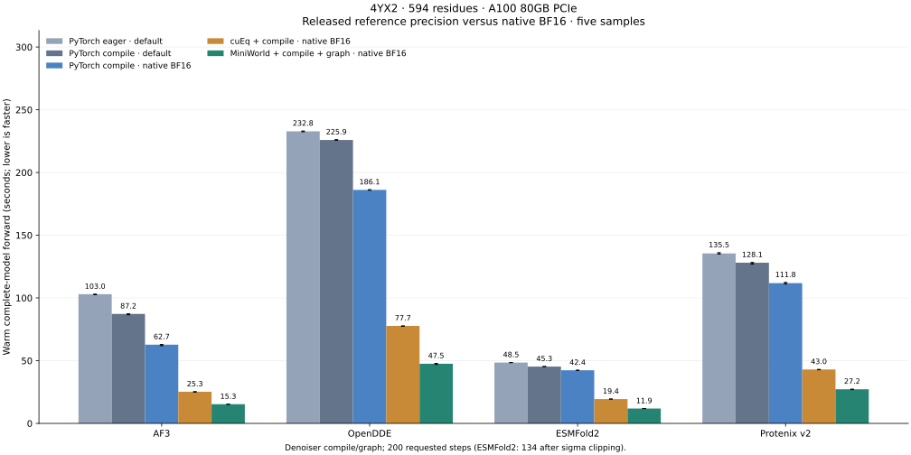
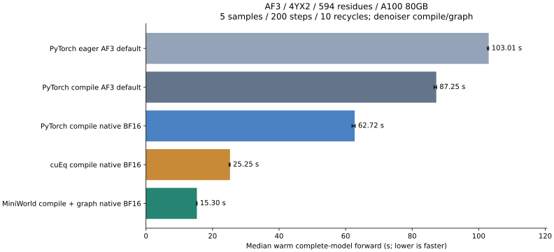

# Inference benchmark results

Updated 2026-09-18. **4YX2: 594 residues, three chains (163 + 218 + 213).**
All four models now have five measured configurations. Reference means each
model's released **precision policy** in FoldForge's PyTorch backend; it is not
the original application's complete runtime. Native BF16 stores learned parameters
in BF16 except FP32 norms and uses no autocast.



Latency is the median of **five warm complete-model forwards**, in seconds.
It includes trunk, diffusion and confidence. It excludes featurization, checkpoint
loading, initial compilation/capture, precomputed ESMC embeddings and CIF output.
The initial forward is reported separately. Error bars are warm min/max.

| Model | Reference eager | Reference compile | Native BF16 compile | cuEq BF16 compile | MiniWorld BF16 compile + graph | MiniWorld vs reference compile |
|---|---:|---:|---:|---:|---:|---:|
| AF3 | 103.012 | 87.250 | 62.721 | 25.251 | 15.301 | 5.70x |
| OpenDDE | 232.806 | 225.874 | 186.136 | 77.709 | 47.525 | 4.75x |
| ESMFold2 | 48.498 | 45.302 | 42.370 | 19.398 | 11.863 | 3.82x |
| Protenix v2 | 135.468 | 128.075 | 111.821 | 43.006 | 27.200 | 4.71x |

**Quality caveat:** Protenix v2 and OpenDDE native BF16 runs show more
local geometry outliers than their default-precision references. The speed
comparison does **not** establish structure-quality equivalence; see the
per-sample checks below.

## Changes since the 2026-09-16 report

The previous table measured each checkpoint with its own released MSA consumption,
a 2048-row input cap, no templates and one coupled seed. This table applies one
input policy to all four models, taken from the AF3 pipeline. The runs are new;
the reports record the difference.

| Input | 2026-09-16 report | This report |
|---|---|---|
| Seeds | coupled `seed: 0` | `trunk_seed: 0`, `diffusion_seed: 0` (split-v1) |
| Prepared MSA rows | capped at 2048 | up to 16384; 4YX2 chains have 429, 9772 and 9043 |
| Rows the MSA module embeds per recycle | AF3 1024; OpenDDE 1280; Protenix v2 a random 1 to n (559 in that run); ESMFold2 every row, embedded once | 1024 sampled rows, re-drawn every recycle, in every model |
| MSA padding inside the model | up to the 2048-row bucket | none: 1024-row bucket |
| Templates | none | four per chain for AF3, Protenix v2 and OpenDDE; ESMFold2 has no template path |

The policy is recorded as `msa_policy: af3-msa-v1` in every run report, and the
flat adapters record `sampled_msa_buckets: [1024, 1024]`.

| Model | MiniWorld 2026-09-16 (s) | MiniWorld now (s) | Reference compile 2026-09-16 (s) | Reference compile now (s) |
|---|---:|---:|---:|---:|
| AF3 | 15.49 | 15.30 | 87.41 | 87.25 |
| OpenDDE | 46.94 | 47.53 | 223.75 | 225.87 |
| ESMFold2 | 10.81 | 11.86 | 41.96 | 45.30 |
| Protenix v2 | 27.53 | 27.20 | 128.25 | 128.08 |

Latency barely moves because the changed work is a small share of a forward.
AF3 already sampled 1024 rows per recycle; only its sampling pool and the
templates changed, and its MSA stack and template embedding were 7.6% and 3.5%
of a warm forward in the stage profile. OpenDDE and Protenix v2 previously
padded their rows to 2048 inside the MSA stack, so removing that padding offsets
the added template embedding. ESMFold2 is the one model whose computation
changed shape: its MSA encoder now runs on every recurrence loop, as its paper
specifies, instead of once, and it pays about 10%. The speed ratios between
backends are therefore unchanged by the policy; that is the result.

**1024-row MSA bucket.** Measured against the same policy with the previous
smallest bucket of 2048 rows, the 1024 bucket changes warm latency by -3.1% to
+1.6% and lowers peak memory where the MSA stack dominates: AF3 cuEq 4.30 to
3.20 GiB and Protenix v2 reference 11.03 to 8.90 GiB. ESMFold2 samples exactly
1024 rows without bucketing and is unaffected.

**One defective ESMFold2 sample.** With `trunk_seed: 0` and `diffusion_seed: 0`
the fifth diffusion sample misplaces chain A residues 28-30 (C-N up to 22 A) in
four of the five modes; the other four samples are clean in every mode, which is
the whole ESMFold2 peptide-outlier count in the structural checks. A
reference-precision diagnostic on an A6000 (Slurm 1712460) reproduces it with the
same seeds, and it disappears when either seed is changed to 1 or when the same
seeds run with the released whole-MSA embedding. That is one defective sample in
twenty diagnostic samples; its rate is not established, so it is reported as
observed rather than attributed to the policy. ESMFold2's paper always keeps the
query row when it samples; FoldForge's shared sampler ranks all valid rows
equally and can omit it.

The earlier report, its assets, dtype audits and batching verification are
preserved in [archive/benchmark-20260916](../benchmark-20260916/benchmark_results.md).

## Precision and execution conditions

| Model | Reference parameter storage and execution | TF32 in reference |
|---|---|---|
| AF3 | Released mixed parameters: BF16 trunk/confidence Pairformers; FP32 input atom encoder, diffusion, norms and final heads. No autocast. | disabled |
| OpenDDE | FP32 parameters and execution; no autocast. | enabled |
| ESMFold2 | FP32 parameters; BF16 autocast in input/trunk, confidence folding trunk and diffusion pair transitions. Remaining diffusion/head projections FP32. Atom FlashAttention uses BF16 Q/K/V. | enabled |
| Protenix v2 | FP32 parameters; BF16 autocast with diffusion explicitly in FP32. Confidence stays in the outer BF16 autocast scope. | enabled |

Reference AMP scopes follow [Protenix inference](https://github.com/bytedance/Protenix/blob/main/runner/inference.py),
[ESMFold2 pinned implementation](https://github.com/Biohub/transformers/blob/b435f1f92dd5b4a653be57157d4f4f5ddba4f145/src/transformers/models/esmfold2/modeling_esmfold2.py),
and [OpenDDE defaults](https://github.com/aurekaresearch/OpenDDE/blob/main/opendde/config/model_base.py).
These compare backend configurations with common FoldForge adapters, not exact
upstream end-to-end applications. PyTorch mode retains the architecture's permitted
FlashAttention path and uses PyTorch for the other replaceable operations.

All cases use trunk_seed=0 and diffusion_seed=0 (split-v1) and one MSA policy taken from the AF3
pipeline: inputs keep up to 16384 alignment rows (msa_crop_size) and
every trunk pass embeds a fresh random subset of 1024 valid rows
(num_msa), re-drawn on each recycle. This replaces each checkpoint's
released consumption: OpenDDE sampled 1280 rows, Protenix v2 drew a
random-size subset (Uniform[1, n] rows) per cycle, and ESMFold2 embedded
every row on every loop. AF3, Protenix v2 and OpenDDE receive up to
4 templates per
chain (max_templates); ESMFold2 has no template conditioning path and runs
the same MSA policy without templates. Every case requests 200 steps
and five samples. Token buckets use multiples of 128: 594 -> 640. OpenDDE expands
internally to 1140 structural tokens -> 1152. Atom buckets are 8192. Sampled MSA rows are padded to the 1024-row MSA bucket.
Inputs and
ESMC cached embeddings are identical across modes within each model.

Compile and manual CUDA graphs apply to the **denoiser**; trunk time remains
included. Inductor automatic graphs are disabled. AF3's 10 additional recycles
give 11 trunk passes; the other adapters use 10 loops/cycles. All four models
batch five diffusion samples. All four MiniWorld token-attention paths
use `num_aug=5` with pair bias shared across samples. ESMFold2 atom SWA
builds RoPE once per structure and expands with `num_aug=5`; its FlashAttention
interface uses flattened `[augmentation * batch, atoms, heads, dim]` rows.
ESMFold2 retains 134 actual steps after its sigma=256 cutoff; other models use 200.

Hardware is NVIDIA A100 80GB PCIe on gpu04, gpu07. Slurm job IDs
are retained in the raw results.
Each mode owns one GPU, requests 16 CPUs and 96 GiB RAM, and uses OMP_NUM_THREADS=8.
PyTorch 2.10.0+cu128. Fresh processes may reuse disk caches. Missing MiniWorld
tuned entries can trigger initial heuristic autotuning; these are warm latencies,
not a claim of fully tuned performance. Per-case logs are preserved under runs/.

## Memory and execution evidence

| Model | Mode | Peak allocated GiB | Warm min-max (s) | Initial forward (s) | Compiled graphs / manual replays | Job |
|---|---|---:|---:|---:|---:|---:|
| AF3 | PyTorch eager · default | 6.44 | 102.605-103.027 | 101.586 | 0 / 0 | 47117 |
| AF3 | PyTorch compile · default | 6.44 | 86.542-87.376 | 148.815 | 1 / 0 | 47117 |
| AF3 | PyTorch compile · native BF16 | 6.03 | 61.921-62.914 | 129.204 | 1 / 0 | 47117 |
| AF3 | cuEq + compile · native BF16 | 3.20 | 24.977-25.307 | 43.797 | 1 / 0 | 47117 |
| AF3 | MiniWorld + compile + graph · native BF16 | 3.64 | 15.166-15.369 | 320.877 | 1 / 1200 | 47117 |
| OpenDDE | PyTorch eager · default | 24.49 | 232.457-233.045 | 232.451 | 0 / 0 | 47118 |
| OpenDDE | PyTorch compile · default | 24.49 | 225.737-226.148 | 304.050 | 1 / 0 | 47118 |
| OpenDDE | PyTorch compile · native BF16 | 20.08 | 185.870-186.291 | 288.367 | 1 / 0 | 47118 |
| OpenDDE | cuEq + compile · native BF16 | 20.08 | 77.353-77.775 | 94.269 | 1 / 0 | 47118 |
| OpenDDE | MiniWorld + compile + graph · native BF16 | 20.96 | 47.002-47.795 | 342.953 | 1 / 1200 | 47118 |
| ESMFold2 | PyTorch eager · default | 28.10 | 48.402-48.580 | 48.494 | 0 / 0 | 47119 |
| ESMFold2 | PyTorch compile · default | 28.10 | 45.245-45.379 | 71.771 | 1 / 0 | 47119 |
| ESMFold2 | PyTorch compile · native BF16 | 21.97 | 42.256-42.427 | 69.406 | 1 / 0 | 47119 |
| ESMFold2 | cuEq + compile · native BF16 | 21.97 | 19.332-19.444 | 25.142 | 1 / 0 | 47119 |
| ESMFold2 | MiniWorld + compile + graph · native BF16 | 9.67 | 11.799-11.868 | 115.673 | 1 / 804 | 47119 |
| Protenix v2 | PyTorch eager · default | 8.90 | 134.998-136.092 | 134.386 | 0 / 0 | 47120 |
| Protenix v2 | PyTorch compile · default | 8.90 | 126.934-128.318 | 209.644 | 1 / 0 | 47120 |
| Protenix v2 | PyTorch compile · native BF16 | 7.86 | 111.161-112.373 | 206.477 | 1 / 0 | 47120 |
| Protenix v2 | cuEq + compile · native BF16 | 7.86 | 42.698-43.069 | 56.714 | 1 / 0 | 47120 |
| Protenix v2 | MiniWorld + compile + graph · native BF16 | 8.98 | 26.942-27.329 | 238.955 | 1 / 1200 | 47120 |

Peak allocation includes initial and repeated forwards. Execution counters come
from observed compiler graphs and manual replays, not requested flags.

[Raw configs, inputs, timings and execution counters](assets/benchmark_results.json).

## Reproduction

Run inside an allocated GPU job:

```bash
python scripts/benchmark_end_to_end.py --model esmfold2 --targets 4yx2 \
  --root benchmark-default --benchmark-repeats 5 --steps 200 \
  --recycles 10 --samples 5 \
  --msa-depth 16384 --template-n 4
```

Use `--model opendde`, or `--model protenix --variant protenix-v2`.
The first two modes select `model_default` (`af3_default` for AF3). The three
comparison modes select native BF16. Whole-model FP32 remains an explicit
diagnostic mode; it is not substituted for the model-default reference.
## Other-model precision and structural checks

All six reference/native BF16 dtype audits passed. Native BF16 explicitly
clears inherited FP32 Linear compute overrides, including geometry and
diffusion-conditioning projections. Norm parameters remain FP32; no
autocast is used in native modes. Sampler coordinates, geometry buffers
and numerical reductions can still use FP32; this is not a claim that
every floating-point tensor is BF16.

For MiniWorld native BF16, maximum peptide C-N lengths in Protenix v2
and OpenDDE are 2.254 A and 1.686 A, respectively.
Their compiled default-precision references reach 1.554 A and 1.342 A.
ESMFold2 reaches 22.142 A against 21.974 A in its reference.
Inspect the outlier counts below; finite coordinates alone are not a quality pass.

The dtype audits here and the kernel-shape audits below are code-path
checks recorded on 2026-09-16 and reused: they run one
recycle and two steps and do not depend on MSA rows or templates.

Below: same-index samples compared with each model's compiled reference.
CA RMSD uses all residues after rigid alignment; it includes numerical
trajectory divergence and is not an experimental accuracy score. Geometry
counts sum five samples; these do not establish accuracy equivalence.

| Model | Mode | CA RMSD range (A) | Finite samples | Peptide C-N outside 1.0-1.7 A | Heavy-atom pairs <1 A |
|---|---|---:|---:|---:|---:|
| ESMFold2 | PyTorch eager · default | 0.058-0.137 | 5/5 | 3 | 3 |
| ESMFold2 | PyTorch compile · default | 0.000-0.000 | 5/5 | 3 | 3 |
| ESMFold2 | PyTorch compile · native BF16 | 1.096-2.809 | 5/5 | 2 | 10 |
| ESMFold2 | cuEq + compile · native BF16 | 1.297-5.107 | 5/5 | 0 | 3 |
| ESMFold2 | MiniWorld + compile + graph · native BF16 | 0.511-5.141 | 5/5 | 3 | 5 |
| Protenix v2 | PyTorch eager · default | 0.004-0.011 | 5/5 | 0 | 1 |
| Protenix v2 | PyTorch compile · default | 0.000-0.000 | 5/5 | 0 | 1 |
| Protenix v2 | PyTorch compile · native BF16 | 0.376-1.347 | 5/5 | 29 | 75 |
| Protenix v2 | cuEq + compile · native BF16 | 0.367-2.023 | 5/5 | 28 | 73 |
| Protenix v2 | MiniWorld + compile + graph · native BF16 | 0.367-2.645 | 5/5 | 34 | 92 |
| OpenDDE | PyTorch eager · default | 0.002-0.003 | 5/5 | 0 | 0 |
| OpenDDE | PyTorch compile · default | 0.000-0.000 | 5/5 | 0 | 0 |
| OpenDDE | PyTorch compile · native BF16 | 0.144-0.295 | 5/5 | 3 | 28 |
| OpenDDE | cuEq + compile · native BF16 | 0.138-0.209 | 5/5 | 6 | 28 |
| OpenDDE | MiniWorld + compile + graph · native BF16 | 0.144-0.316 | 5/5 | 4 | 30 |

[Precision audits](assets/precision_audits.json) · [Per-sample structural checks](assets/structure_checks.json).

## Shared sample-axis verification

32 GPU tests passed, including two structures with three samples and
different atom masks, compared with independent sample execution.
Real-checkpoint eager audits observe the kernel boundary independently
of compiled timings. Trunk triangle rows are excluded from these records.

| Model | Token Q shape | Core layout | Shared pair bias shape |
|---|---|---|---|
| ESMFold2 | `[5, 1, 640, 16, 48]` | `ABLHD` | `[1, 640, 640, 16]` |
| Protenix v2 | `[5, 1, 16, 640, 48]` | `ABHLD` | `[1, 16, 640, 640]` |
| OpenDDE | `[5, 1, 16, 1152, 48]` | `ABHLD` | `[1, 16, 1152, 1152]` |

A is augmentation, B structure batch, H heads, L tokens and D head width.
ESMFold2 already used augmentation-aware token attention; its atom path
now builds static conditioning/RoPE per structure and expands through
the SWA API with num_aug=5. Protenix/OpenDDE square token attention now
preserves the sample axis instead of flattening it into structure batch.
Dispatch also checks projected Q/K/V dtypes: FP32 residuals previously
bypassed the engine even when native projections produced BF16 Q/K/V.
Regression tests cover FP32 residuals with BF16 projection parameters.
Their rectangular atom windows retain batched shared PyTorch attention:
the engine pair-biased augmentation core supports square attention only.

Every mode in the latency table comes from one run set. Graph replay
counts are 804 for ESMFold2 and 1200 for Protenix/OpenDDE: six forwards
times 134 or 200 denoising steps, each handling five samples together.

[Observed kernel shapes](assets/sample_axes_audits.json) · [Measured source hashes](assets/sample_axes_source_manifest.json).

## AF3: official default precision versus native BF16



Same 4YX2 input, checkpoint, seed 0, 10 recycles (11 trunk passes), 200 diffusion steps and five batched samples per forward (200 denoiser calls). Median of five warm complete-model forwards; first forward excluded. Compile and manual CUDA graphs cover the denoiser. FP32 operations use highest matmul precision (TF32 disabled). No autocast in any mode.

| Mode | Latency (s) | Peak GiB | Mean CA pLDDT | Experimental CA lDDT (%) | Experimental CA RMSD (A) |
|---|---:|---:|---:|---:|---:|
| PyTorch eager AF3 default | 103.012 | 6.44 | 88.73 | 95.83 | 3.855 |
| PyTorch compile AF3 default | 87.250 | 6.44 | 88.73 | 95.83 | 3.855 |
| PyTorch compile native BF16 | 62.721 | 6.03 | 88.54 | 95.95 | 3.409 |
| cuEq compile native BF16 | 25.251 | 3.20 | 88.57 | 95.95 | 3.511 |
| MiniWorld compile + graph native BF16 | 15.301 | 3.64 | 88.70 | 95.86 | 3.701 |

Quality columns average all five samples; experimental comparison uses 528 observed CA atoms. Numerical comparisons below match the same sample index against PyTorch compile AF3 default using all 594 predicted CA atoms.

| Mode | Reference CA RMSD, all 594 (A) | Observed 528 (A) | Peptide C-N outliers (sum / 5 samples) | Heavy-atom pairs <1 A (sum / 5) |
|---|---:|---:|---:|---:|
| PyTorch eager AF3 default | 0.000-0.000 | 0.000-0.000 | 0 | 0 |
| PyTorch compile AF3 default | 0.000-0.000 | 0.000-0.000 | 0 | 0 |
| PyTorch compile native BF16 | 0.347-1.107 | 0.178-1.041 | 0 | 0 |
| cuEq compile native BF16 | 0.335-0.841 | 0.133-0.722 | 0 | 0 |
| MiniWorld compile + graph native BF16 | 0.386-0.644 | 0.036-0.489 | 0 | 0 |

Peptide outliers use C-N outside 1.0-1.7 A. The <1 A heavy-atom count is a gross-overlap diagnostic, not a full stereochemical clashscore. lDDT here uses CA distances within 15 A and thresholds 0.5/1/2/4 A. Missing experimental residues are excluded. Per-chain RMSD, interface contacts and within-mode sample diversity are included in the JSON.

This single-complex experiment does not establish dataset-level accuracy equivalence. Same-seed diffusion trajectories can diverge after precision changes.

[All structural metrics](assets/af3_precision_quality.json).
