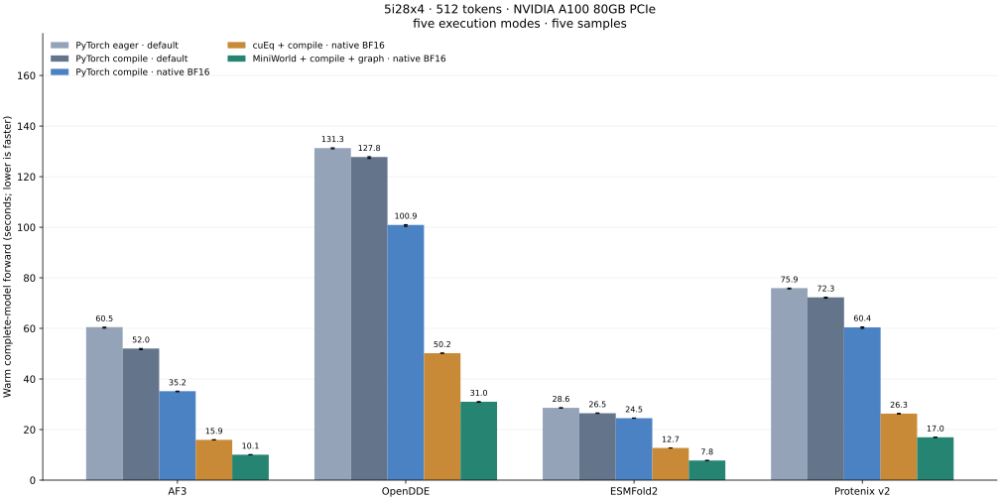
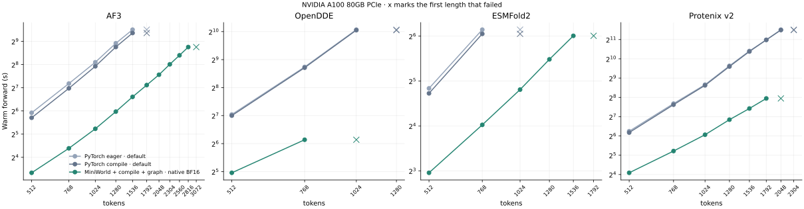
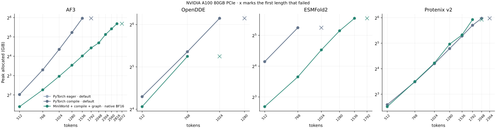
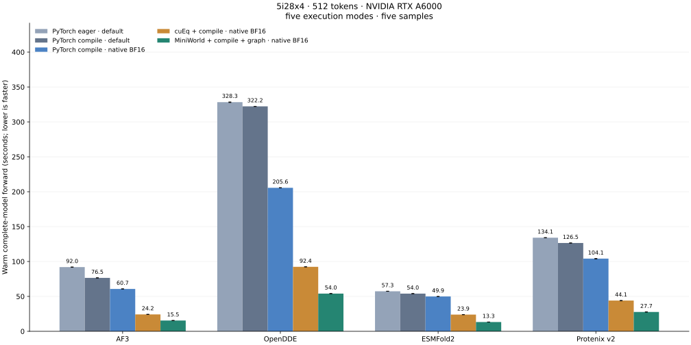
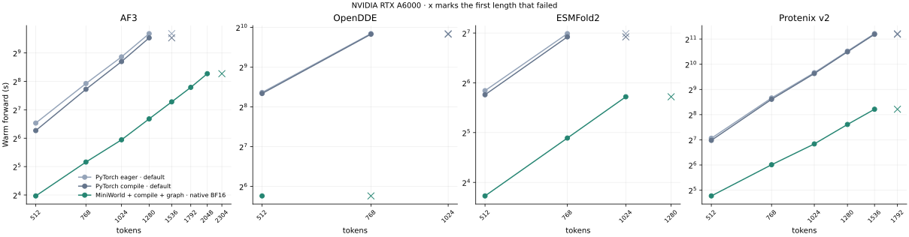
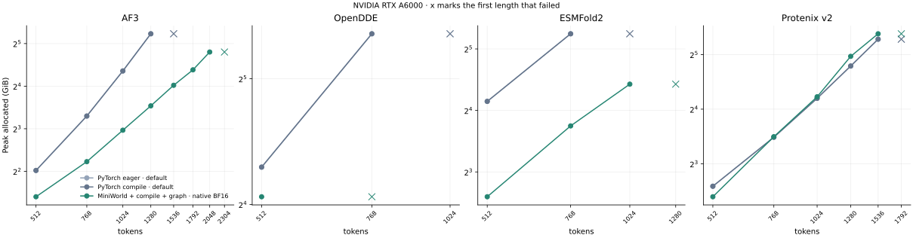

# Inference benchmark results

Updated 2026-09-18. **5I28 azurin, 128 residues per chain, replicated N
times as N identical chains.** Every chain carries the same MSA and
templates, so length scales while the per-residue conditioning does not.

Reference means each model's released precision policy in FoldForge's PyTorch
backend; native BF16 stores learned parameters in BF16 except FP32 norms and
uses no autocast. Latency is the median of five warm complete-model forwards
and excludes featurization, checkpoint loading, initial compilation/capture,
precomputed ESMC embeddings and CIF output. Error bars are warm min/max.

Inputs follow one MSA policy for every model: up to 16384 prepared alignment rows, 1024 rows sampled per recycle, and 4 templates per chain
(ESMFold2 has no template path). Compile and manual CUDA graphs cover the
denoiser; 200 requested diffusion steps (ESMFold2 keeps 134 after its sigma
cutoff), 10 recycles, five samples, trunk_seed=0 and diffusion_seed=0.

## NVIDIA A100 80GB PCIe: five modes at 512 tokens



| Model | Reference eager | Reference compile | Native BF16 compile | cuEq BF16 compile | MiniWorld BF16 compile + graph | MiniWorld vs reference compile |
|---|---:|---:|---:|---:|---:|---:|
| AF3 | 60.491 | 52.042 | 35.175 | 15.935 | 10.067 | 5.17x |
| OpenDDE | 131.284 | 127.754 | 100.905 | 50.190 | 30.999 | 4.12x |
| ESMFold2 | 28.595 | 26.457 | 24.508 | 12.738 | 7.771 | 3.40x |
| Protenix v2 | 75.924 | 72.275 | 60.415 | 26.306 | 16.956 | 4.26x |

| Model | Mode | Peak allocated GiB | Warm min-max (s) | Initial forward (s) | Compiled graphs / manual replays | Job |
|---|---|---:|---:|---:|---:|---:|
| AF3 | PyTorch eager · default | 4.06 | 60.099-60.500 | 61.234 | 0 / 0 | 47410 |
| AF3 | PyTorch compile · default | 4.06 | 51.613-52.080 | 113.927 | 1 / 0 | 47410 |
| AF3 | PyTorch compile · native BF16 | 3.64 | 34.941-35.211 | 102.049 | 1 / 0 | 47410 |
| AF3 | cuEq + compile · native BF16 | 2.33 | 15.887-16.005 | 28.312 | 1 / 0 | 47410 |
| AF3 | MiniWorld + compile + graph · native BF16 | 2.65 | 10.021-10.111 | 329.143 | 1 / 1200 | 47410 |
| OpenDDE | PyTorch eager · default | 19.66 | 130.991-131.401 | 130.547 | 0 / 0 | 47411 |
| OpenDDE | PyTorch compile · default | 19.66 | 127.195-127.888 | 194.283 | 1 / 0 | 47411 |
| OpenDDE | PyTorch compile · native BF16 | 15.97 | 100.331-101.027 | 187.528 | 1 / 0 | 47411 |
| OpenDDE | cuEq + compile · native BF16 | 15.97 | 50.115-50.273 | 64.977 | 1 / 0 | 47411 |
| OpenDDE | MiniWorld + compile + graph · native BF16 | 16.69 | 30.771-31.081 | 315.193 | 1 / 1200 | 47411 |
| ESMFold2 | PyTorch eager · default | 17.72 | 28.498-28.668 | 29.587 | 0 / 0 | 47412 |
| ESMFold2 | PyTorch compile · default | 17.72 | 26.406-26.567 | 59.725 | 1 / 0 | 47412 |
| ESMFold2 | PyTorch compile · native BF16 | 13.91 | 24.461-24.582 | 55.001 | 1 / 0 | 47412 |
| ESMFold2 | cuEq + compile · native BF16 | 13.91 | 12.702-12.756 | 19.818 | 1 / 0 | 47412 |
| ESMFold2 | MiniWorld + compile + graph · native BF16 | 6.05 | 7.759-7.792 | 116.911 | 1 / 804 | 47412 |
| Protenix v2 | PyTorch eager · default | 6.02 | 75.615-75.955 | 77.215 | 0 / 0 | 47413 |
| Protenix v2 | PyTorch compile · default | 6.02 | 71.911-72.365 | 137.098 | 1 / 0 | 47413 |
| Protenix v2 | PyTorch compile · native BF16 | 5.04 | 59.990-60.592 | 142.443 | 1 / 0 | 47413 |
| Protenix v2 | cuEq + compile · native BF16 | 5.04 | 26.156-26.391 | 40.671 | 1 / 0 | 47413 |
| Protenix v2 | MiniWorld + compile + graph · native BF16 | 5.70 | 16.876-17.002 | 245.657 | 1 / 1200 | 47413 |

[Raw rows](assets/benchmark_matrix_a100.json).

## NVIDIA A100 80GB PCIe: length scaling





Warm median seconds and peak allocated GiB per length. **OOM** marks a CUDA out-of-memory failure recorded in that process log; other failures show their reason. Every length is its own process. † marks one warm forward instead of the median of five, used where one forward takes tens of minutes.

### AF3

| Tokens | Chains | PyTorch eager · default s | GiB | PyTorch compile · default s | GiB | MiniWorld + compile + graph · native BF16 s | GiB |
|---:|---:|---:|---:|---:|---:|---:|---:|
| 512 | 4 | 60.59 | 4.1 | 52.20 | 4.1 | 10.09 | 2.6 |
| 768 | 6 | 145.10 | 9.8 | 125.85 | 9.8 | 20.96 | 4.8 |
| 1024 | 8 | 274.16 | 20.5 | 242.95 | 20.5 | 37.53 | 7.8 |
| 1280 | 10 | 483.48 | 37.5 | 432.35 | 37.5 | 62.71 | 11.6 |
| 1536 | 12 | 725.82 | 62.4 | 656.65 | 62.4 | 97.44 | 16.2 |
| 1792 | 14 | **OOM** | - | **OOM** | - | 138.64 | 21.6 |
| 2048 | 16 | **OOM** | - | **OOM** | - | 188.79 | 25.9 |
| 2304 | 18 | **OOM** | - | **OOM** | - | 257.77 | 35.0 |
| 2560 | 20 | **OOM** | - | **OOM** | - | 337.25 | 42.8 |
| 2816 | 22 | **OOM** | - | **OOM** | - | 431.66 | 51.4 |
| 3072 | 24 | **OOM** | - | **OOM** | - | **OOM** | - |

Every longer length fails in every mode.

### OpenDDE

| Tokens | Chains | PyTorch eager · default s | GiB | PyTorch compile · default s | GiB | MiniWorld + compile + graph · native BF16 s | GiB |
|---:|---:|---:|---:|---:|---:|---:|---:|
| 512 | 4 | 131.53 | 19.7 | 127.98 | 19.7 | 31.09 | 16.7 |
| 768 | 6 | 427.03 | 41.0 | 419.06 | 41.0 | 70.42 | 38.0 |
| 1024 | 8 | 1074.13 | 70.9 | 1061.03 | 70.9 | **OOM** | - |
| 1280 | 10 | **OOM** | - | **OOM** | - | **OOM** | - |

Every longer length fails in every mode.

### ESMFold2

| Tokens | Chains | PyTorch eager · default s | GiB | PyTorch compile · default s | GiB | MiniWorld + compile + graph · native BF16 s | GiB |
|---:|---:|---:|---:|---:|---:|---:|---:|
| 512 | 4 | 28.57 | 17.7 | 26.45 | 17.7 | 7.76 | 6.4 |
| 768 | 6 | 70.70 | 38.0 | 66.28 | 38.0 | 16.26 | 12.6 |
| 1024 | 8 | **OOM** | - | **OOM** | - | 28.02 | 23.1 |
| 1280 | 10 | **OOM** | - | **OOM** | - | 44.70 | 35.4 |
| 1536 | 12 | **OOM** | - | **OOM** | - | 64.30 | 46.9 |
| 1792 | 14 | **OOM** | - | **OOM** | - | **OOM** | - |

Every longer length fails in every mode.

### Protenix v2

| Tokens | Chains | PyTorch eager · default s | GiB | PyTorch compile · default s | GiB | MiniWorld + compile + graph · native BF16 s | GiB |
|---:|---:|---:|---:|---:|---:|---:|---:|
| 512 | 4 | 75.83 | 6.0 | 72.26 | 6.0 | 17.02 | 5.7 |
| 768 | 6 | 204.78 | 11.2 | 196.90 | 11.2 | 37.20 | 11.3 |
| 1024 | 8 | 404.63 | 18.4 | 394.16 | 18.4 | 66.85 | 18.7 |
| 1280 | 10 | 796.14 | 27.7 | 776.39 | 27.7 | 114.90 | 31.2 |
| 1536 | 12 | 1356.61† | 38.9 | 1331.51† | 38.9 | 171.65 | 40.1 |
| 1792 | 14 | 2027.25† | 52.1 | 2020.80† | 52.1 | 246.43 | 60.8 |
| 2048 | 16 | 2920.64† | 63.0 | 2880.78† | 63.0 | **OOM** | - |
| 2304 | 18 | **OOM** | - | **OOM** | - | - | - |

Every longer length fails in every mode.

[Raw rows](assets/benchmark_scaling_a100.json).

## NVIDIA RTX A6000: five modes at 512 tokens



| Model | Reference eager | Reference compile | Native BF16 compile | cuEq BF16 compile | MiniWorld BF16 compile + graph | MiniWorld vs reference compile |
|---|---:|---:|---:|---:|---:|---:|
| AF3 | 92.003 | 76.545 | 60.684 | 24.210 | 15.456 | 4.95x |
| OpenDDE | 328.262 | 322.227 | 205.571 | 92.373 | 54.027 | 5.96x |
| ESMFold2 | 57.335 | 54.001 | 49.912 | 23.945 | 13.298 | 4.06x |
| Protenix v2 | 134.092 | 126.525 | 104.143 | 44.063 | 27.710 | 4.57x |

| Model | Mode | Peak allocated GiB | Warm min-max (s) | Initial forward (s) | Compiled graphs / manual replays | Job |
|---|---|---:|---:|---:|---:|---:|
| AF3 | PyTorch eager · default | 4.06 | 91.928-92.024 | 92.021 | 0 / 0 | 1713062 |
| AF3 | PyTorch compile · default | 4.06 | 76.504-76.604 | 119.518 | 1 / 0 | 1713062 |
| AF3 | PyTorch compile · native BF16 | 3.64 | 60.663-60.793 | 108.914 | 1 / 0 | 1713062 |
| AF3 | cuEq + compile · native BF16 | 2.33 | 24.122-24.334 | 33.737 | 1 / 0 | 1713062 |
| AF3 | MiniWorld + compile + graph · native BF16 | 2.58 | 15.412-15.528 | 121.460 | 1 / 1200 | 1713062 |
| OpenDDE | PyTorch eager · default | 19.66 | 327.762-328.522 | 328.499 | 0 / 0 | 1713064 |
| OpenDDE | PyTorch compile · default | 19.66 | 321.953-322.278 | 360.631 | 1 / 0 | 1713064 |
| OpenDDE | PyTorch compile · native BF16 | 15.97 | 205.476-205.744 | 252.373 | 1 / 0 | 1713064 |
| OpenDDE | cuEq + compile · native BF16 | 15.97 | 92.250-92.450 | 100.900 | 1 / 0 | 1713064 |
| OpenDDE | MiniWorld + compile + graph · native BF16 | 16.69 | 53.910-54.144 | 181.175 | 1 / 1200 | 1713064 |
| ESMFold2 | PyTorch eager · default | 17.72 | 57.308-57.467 | 57.253 | 0 / 0 | 1713065 |
| ESMFold2 | PyTorch compile · default | 17.72 | 53.904-54.061 | 70.079 | 1 / 0 | 1713065 |
| ESMFold2 | PyTorch compile · native BF16 | 13.91 | 49.752-49.914 | 66.255 | 1 / 0 | 1713065 |
| ESMFold2 | cuEq + compile · native BF16 | 13.91 | 23.857-23.969 | 28.599 | 1 / 0 | 1713065 |
| ESMFold2 | MiniWorld + compile + graph · native BF16 | 6.44 | 13.214-13.383 | 71.383 | 1 / 804 | 1713065 |
| Protenix v2 | PyTorch eager · default | 6.02 | 134.056-134.168 | 134.156 | 0 / 0 | 1713066 |
| Protenix v2 | PyTorch compile · default | 6.02 | 126.429-126.553 | 162.621 | 1 / 0 | 1713066 |
| Protenix v2 | PyTorch compile · native BF16 | 5.04 | 103.829-104.229 | 147.558 | 1 / 0 | 1713066 |
| Protenix v2 | cuEq + compile · native BF16 | 5.04 | 43.901-44.074 | 52.083 | 1 / 0 | 1713066 |
| Protenix v2 | MiniWorld + compile + graph · native BF16 | 5.71 | 27.594-27.718 | 88.015 | 1 / 1200 | 1713066 |

[Raw rows](assets/benchmark_matrix_a6000.json).

## NVIDIA RTX A6000: length scaling





Warm median seconds and peak allocated GiB per length. **OOM** marks a CUDA out-of-memory failure recorded in that process log; other failures show their reason. Every length is its own process. † marks one warm forward instead of the median of five, used where one forward takes tens of minutes.

### AF3

| Tokens | Chains | PyTorch eager · default s | GiB | PyTorch compile · default s | GiB | MiniWorld + compile + graph · native BF16 s | GiB |
|---:|---:|---:|---:|---:|---:|---:|---:|
| 512 | 4 | 92.56 | 4.1 | 77.07 | 4.1 | 15.64 | 2.6 |
| 768 | 6 | 242.93 | 9.8 | 211.10 | 9.8 | 35.75 | 4.7 |
| 1024 | 8 | 465.37 | 20.5 | 415.04 | 20.5 | 61.54 | 7.8 |
| 1280 | 10 | 820.23 | 37.5 | 740.11 | 37.5 | 102.50 | 11.6 |
| 1536 | 12 | **OOM** | - | **OOM** | - | 155.28 | 16.2 |
| 1792 | 14 | **OOM** | - | **OOM** | - | 221.21 | 20.9 |
| 2048 | 16 | **OOM** | - | **OOM** | - | 308.78 | 27.9 |
| 2304 | 18 | **OOM** | - | **OOM** | - | **OOM** | - |

Every longer length fails in every mode.

### OpenDDE

| Tokens | Chains | PyTorch eager · default s | GiB | PyTorch compile · default s | GiB | MiniWorld + compile + graph · native BF16 s | GiB |
|---:|---:|---:|---:|---:|---:|---:|---:|
| 512 | 4 | 329.01 | 19.7 | 323.02 | 19.7 | 54.28 | 16.7 |
| 768 | 6 | 916.59 | 41.0 | 907.55 | 41.0 | **OOM** | - |
| 1024 | 8 | **OOM** | - | **OOM** | - | **OOM** | - |

Every longer length fails in every mode.

### ESMFold2

| Tokens | Chains | PyTorch eager · default s | GiB | PyTorch compile · default s | GiB | MiniWorld + compile + graph · native BF16 s | GiB |
|---:|---:|---:|---:|---:|---:|---:|---:|
| 512 | 4 | 57.40 | 17.7 | 54.23 | 17.7 | 13.25 | 6.0 |
| 768 | 6 | 126.99 | 38.0 | 121.40 | 38.0 | 29.67 | 13.4 |
| 1024 | 8 | **OOM** | - | **OOM** | - | 52.71 | 21.5 |
| 1280 | 10 | **OOM** | - | **OOM** | - | **OOM** | - |

Every longer length fails in every mode.

### Protenix v2

| Tokens | Chains | PyTorch eager · default s | GiB | PyTorch compile · default s | GiB | MiniWorld + compile + graph · native BF16 s | GiB |
|---:|---:|---:|---:|---:|---:|---:|---:|
| 512 | 4 | 133.60 | 6.0 | 126.09 | 6.0 | 27.32 | 5.3 |
| 768 | 6 | 404.90 | 11.2 | 390.31 | 11.2 | 64.47 | 11.3 |
| 1024 | 8 | 811.98 | 18.4 | 793.27 | 18.4 | 114.29 | 18.7 |
| 1280 | 10 | 1468.81† | 27.7 | 1441.44† | 27.7 | 195.30 | 31.3 |
| 1536 | 12 | 2378.15† | 38.9 | 2335.81† | 38.9 | 296.91 | 41.6 |
| 1792 | 14 | **OOM** | - | **OOM** | - | **OOM** | - |

Every longer length fails in every mode.

[Raw rows](assets/benchmark_scaling_a6000.json).

## Reproduction

```bash
python scripts/benchmark_end_to_end.py --model af3 --targets 5i28x4 \
  --root matrix --benchmark-repeats 5 --steps 200 --recycles 10 --samples 5
python scripts/benchmark_end_to_end.py --model af3 \
  --targets 5i28x4 5i28x8 5i28x12 5i28x16 5i28x20 5i28x24 5i28x32 \
  --modes pytorch_eager_reference pytorch_compile_reference \
    miniworld_graph \
  --root scaling --benchmark-repeats 5 --steps 200 --recycles 10 --samples 5
python scripts/render_length_benchmark.py --set a100 matrix scaling
```

Use `--model opendde`, `--model esmfold2` or `--model protenix --variant protenix-v2`; inputs live under `validation/inputs/qualification/5i28x<N>/`.

## Notes

**What changed since the 4YX2 report.** The target is now 5I28 azurin (128
residues) replicated as N identical chains, so one input family covers every
length. The five-mode comparison runs at 512 tokens; the length ladder runs the
two reference modes and the MiniWorld mode from 512 tokens in 256-token steps
until every mode fails. The MSA and template policy is unchanged (`af3-msa-v1`).
The 4YX2 report is preserved in
[archive/benchmark-20260918-4yx2](archive/benchmark-20260918-4yx2/benchmark_results.md).

**Longest length that runs** (tokens; reference is the same for eager and compile):

| Model | A100 80 GB reference | A100 80 GB MiniWorld | A6000 48 GB reference | A6000 48 GB MiniWorld |
|---|---:|---:|---:|---:|
| AF3 | 1536 | 2816 | 1280 | 2048 |
| OpenDDE | 1024 | 768 | 768 | 512 |
| ESMFold2 | 768 | 1536 | 768 | 1024 |
| Protenix v2 | 2048 | 1792 | 1536 | 1536 |

**The speed ratio grows with length.** MiniWorld against reference compile goes
from 5.2x at 512 tokens to 6.9x at 1280 for AF3 on the A100, and from 4.2x to
8.2x at 1792 for Protenix v2. The A6000 shows the same trend (AF3 4.9x to 7.2x,
Protenix v2 4.6x to 7.9x). Moving from the A6000 to the A100 speeds every mode
up by 1.5x to 2.5x and leaves the ratios about where they were.

**Where MiniWorld mode runs out of memory first.** OpenDDE fails one length
earlier in MiniWorld mode than in the reference on both GPUs; at 768 tokens on
the A6000 the process log shows 27 GiB of 47 GiB held in CUDA-graph private
pools. Protenix v2 on the A100 also fails at 2048 tokens in MiniWorld mode while
the reference still runs; its peak at 1792 tokens is 60.8 GiB against 52.1 GiB.
AF3 and ESMFold2 go the other way and run 1.5x to 2x longer inputs in MiniWorld mode.
The OpenDDE A6000 run at 1280 tokens ended with a Triton illegal memory access
instead of an out-of-memory error and is shown as `exit 1`.

**Single warm forward (†).** Protenix v2 reference rows from 1280 tokens on the
A6000 and from 1536 tokens on the A100 time one warm forward instead of the
median of five, because one forward takes 20 to 50 minutes there. Those rows
ran as separate jobs, one per length and mode, and were merged with
`scripts/merge_benchmark_rows.py`.
